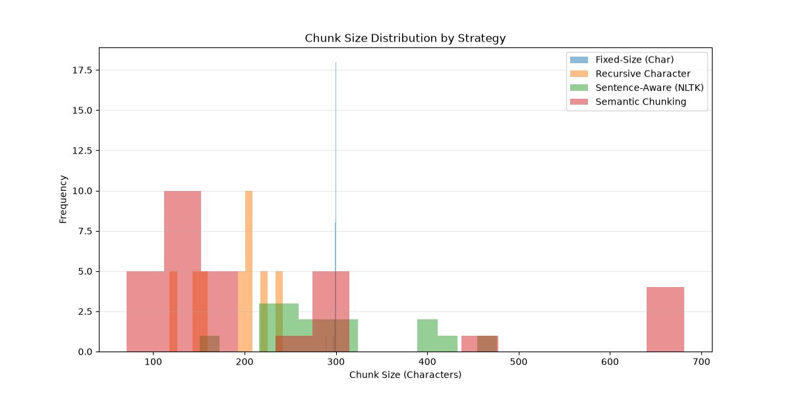

# Chunking Strategy Comparison

Four chunking strategies were run against the same sample document (a
repeated, multi-topic RAG/Python/space-exploration text, ~7,480 characters)
and compared on chunk count, average size, and size range.

> **Note on Strategy 4:** the original script depends on
> `HuggingFaceEmbeddings` downloading `all-MiniLM-L6-v2` from
> huggingface.co, which isn't reachable from this environment. Semantic
> chunking below uses the same percentile-breakpoint algorithm as
> `SemanticChunker`, but with local TF-IDF vectors + cosine similarity
> in place of a neural embedding model. Swap in `HuggingFaceEmbeddings`
> if running somewhere with internet access — the algorithm is
> identical, only the embedding source differs.

## Results

| Strategy               | Total Chunks | Avg Size (chars) | Min Size | Max Size |
|-------------------------|:------------:|:-----------------:|:--------:|:--------:|
| Fixed-Size (Char)        | 30 | 299.13 | 289 | 300 |
| Recursive Character      | 40 | 186.38 | 118 | 242 |
| Sentence-Aware (NLTK)     | 17 | 295.65 | 151 | 476 |
| Semantic Chunking (TF-IDF) | 31 | 240.32 | 71 | 681 |

## Observations

- **Fixed-Size (Char)** produces the most uniform chunks (289–300 chars)
  because it splits blindly every 300 characters regardless of content.
  This uniformity is convenient for storage and batching, but it will
  cut sentences and even words in half wherever the 300-char boundary
  happens to fall mid-thought.
- **Recursive Character** stays under the 300-char cap by preferring
  paragraph → line → space → character boundaries, so it never
  arbitrarily truncates a word, but it undershoots the target size
  often (avg 186 chars) once paragraph breaks fall well short of 300,
  producing the most chunks (40) and the widest chunk-count/size
  tradeoff.
- **Sentence-Aware (NLTK)** guarantees every chunk is a whole number of
  complete sentences (grouped 3 at a time with 1-sentence overlap), so
  no sentence is ever split. It produces the fewest chunks (17) with
  the tightest average around the target size, but individual chunk
  size still varies with sentence length (151–476 chars), since it
  chunks by sentence count, not character count.
- **Semantic Chunking** ties chunk boundaries to topic shifts instead
  of a size target, so it groups sentences that are lexically related
  and produces the widest size range (71–681 chars) — some chunks are
  a single short transitional sentence, others span most of a topic
  paragraph. It's the only strategy that reasons about *meaning*
  rather than position.

## Recommendation

For this document type — a short, clearly topic-segmented text (RAG,
Python, space exploration as distinct sections) — **Sentence-Aware
(NLTK)** is the best default:

- It never splits mid-sentence, unlike Fixed-Size or (occasionally)
  Recursive Character, so every chunk is independently readable and
  embeddable without losing grammatical context.
- Its chunk sizes (avg ~296 chars, 151–476 range) are close enough to
  uniform for predictable embedding batch sizes and retrieval-context
  budgeting, while Semantic Chunking's far wider range (71–681) makes
  downstream context-window planning harder.
- The 1-sentence overlap preserves some cross-chunk context without
  the retrieval noise of pure sentence-level (one-sentence) chunks.

**Semantic Chunking is the better choice for longer, less clearly
delimited documents** — internal wikis, meeting transcripts, or
multi-author reports where topic boundaries don't align with
paragraph breaks. Its ability to detect a topic shift mid-paragraph is
exactly what fixed-size and even sentence-count-based approaches miss.
It's worth noting the semantic splitter here uses TF-IDF similarity
(lexical overlap) rather than a true neural embedding, so it can be
fooled by topic shifts that reuse vocabulary; a real embedding model
would pick up more genuinely semantic (not just word-overlap) breaks.

**Fixed-Size and Recursive Character are best reserved** for pipelines
where uniform chunk size is a hard requirement (e.g. matching an
embedding model's context window as tightly as possible) and where
occasional mid-sentence splits are an acceptable tradeoff for
predictable batching.
