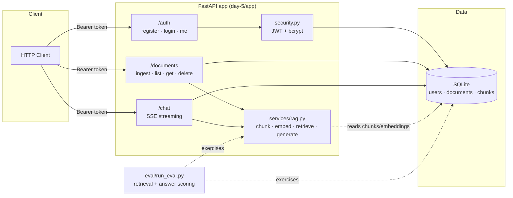

# RAG Assistant

A retrieval-augmented generation API: JWT-authenticated document ingestion,
chunking, embedding, semantic retrieval, and SSE-streamed chat with citations.

## Architecture



**Flow:** a document is split into overlapping word chunks (`chunk_text`),
each chunk is embedded with a deterministic local hashing-vectorizer
(`embed_text` — offline, no API key required), and stored with its
embedding in SQLite. A chat query is embedded the same way, scored against
stored chunks by cosine similarity (`retrieve`), and the top-k chunks feed
an extractive answer generator (`generate_answer`). The answer is streamed
token-by-token over SSE, followed by a `citations` event listing the
source document, chunk index, and similarity score for each chunk used.

The embedding/generation functions are isolated in `services/rag.py`
specifically so a real provider (OpenAI/Gemini) can be swapped in behind
the same interface via the `LLM_PROVIDER` setting, without touching
routers or the eval harness.

## Endpoints

| Method | Path              | Auth | Description                          |
|--------|-------------------|------|---------------------------------------|
| POST   | `/auth/register`  | no   | Create a user                         |
| POST   | `/auth/login`     | no   | Get a JWT access token                |
| GET    | `/auth/me`        | yes  | Current user                          |
| POST   | `/documents`      | yes  | Ingest a document (chunk + embed)     |
| GET    | `/documents`      | yes  | List your documents                   |
| GET    | `/documents/{id}` | yes  | Get one document                      |
| DELETE | `/documents/{id}` | yes  | Delete a document and its chunks      |
| POST   | `/chat`           | yes  | SSE stream: `token`, `citations`, `done` events |
| GET    | `/health`         | no   | Liveness check                        |

## Running

```bash
cp env.example .env
docker compose up --build
# API at http://localhost:8000, docs at /docs
```

Or locally:

```bash
pip install -r requirements.txt
uvicorn app.main:app --reload --app-dir day-5
```

## Tests

```bash
pytest
```

10/10 passing — auth (register/login/duplicate/wrong-password/me), document
CRUD + ownership isolation, and chat SSE streaming (tokens + citations +
auth enforcement).

Code quality: `ruff check` and `mypy --strict`-equivalent both clean
(config in `pyproject.toml`).

## Eval suite

```bash
python eval/run_eval.py
```

5 QA cases over 5 seeded documents, each scored on retrieval hit (did the
right document surface in top-k?) and answer keyword overlap. Score is
written to `eval/results.json` and the script exits non-zero if the
average score falls below `EVAL_BASELINE_SCORE` (default `0.6`).

**Latest run: overall score `0.95` — baseline `0.6` — PASSED**

| Query | Retrieval hit | Keyword overlap | Score |
|---|---|---|---|
| Is Python dynamically typed? | ✅ | 1.00 | 1.00 |
| What HTTP methods does REST use? | ✅ | 1.00 | 1.00 |
| What do vector databases support? | ✅ | 1.00 | 1.00 |
| What does a server do after verifying credentials? | ✅ | 0.50 | 0.75 |
| How are server sent events used with language models? | ✅ | 1.00 | 1.00 |

## Project layout

```
Dockerfile / docker-compose.yml / requirements.txt / env.example
day-5/app/
  main.py            FastAPI app, router wiring, lifespan (init_db)
  config.py          pydantic-settings, env-driven
  security.py        JWT issuing/validation, bcrypt hashing
  schemas.py         Pydantic request/response models
  db/
    models.py        SQLAlchemy models: User, Document, Chunk
    database.py       async engine/session
  routers/
    auth.py            register, login, me
    documents.py        ingest, list, get, delete
    chat.py              SSE chat with citations
  services/
    rag.py               chunking, embedding, retrieval, generation
    eval.py               scoring primitives used by eval/run_eval.py
tests/                pytest + httpx ASGI client, in-memory SQLite
eval/
  dataset.json          5 seeded QA cases
  run_eval.py            harness -> eval/results.json
```

## Notes on the mock LLM/embedding layer

There's no network access to an external LLM/embedding API in this
environment, so both `embed_text` and `generate_answer` are deterministic,
offline, dependency-free implementations (hashing vectorizer +
extractive synthesis). They live behind the same function signatures a
real provider would use, so wiring in OpenAI/Gemini is a matter of
branching on `settings.llm_provider` inside `services/rag.py` — nothing
in the routers, schemas, or eval harness needs to change.
